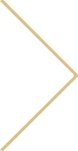

# 🔖동기부여 명언 카드 사이트


> _" 하루하루 코드를 정복해가며 발전하고 있지만 어느날 지쳐버린 나 그리고 우리를 위해 만든 동기부여 명언카드 사이트입니다. "_

- 프로젝트 이름: 동기부여 명언카드(Motivation Card)
- 분류 : 토이 프로젝트 (개인)
- 제작 기간 : 2022.05.21
- 사용 툴 : HTML, CSS, JavaScript
- [GitHub](https://github.com/chooing/toyProject/tree/main/carouselCard)
- [GitHub Pages](https://chooing.github.io/toyProject/carouselCard/)

# 📌 목표
- carousel UI, flip animation을 HTML, CSS로 구현
- CSS 변수를 사용하고 CSS변수와 JavaScript를 연결해 카드 이동 구현
- 랜덤으로 동기부여에 관련된 명언 카드가 배치되도록 하여 매번 새로운 카드로 동기부여 전달

# 📁 기능
- 카드의 내용을 배열로 두어 새로고침 시 랜덤으로 카드 내용 설정
- 화면의 양옆을 클릭 시 좌우로 carousel 이동
- 가운데 카드에 flip animation을 적용해 hover 시 카드가 뒤집히며 카드 내용 확인

# ✍ 구현하면서 겪은 문제 겸 회고
- 부모요소가 기준이 되어 자식요소들이 강강술래하듯 원근감 있게 감싸듯 배치하는 것이 어려웠다. 중심을 기준으로 배치하는 것 까진 겨우 성공했지만 * 모양이 되어서 원근감 없이 표현됬다. 해결하고자 열심히 구글링을 해보았고 **부모요소에 `ransform-style:preserve-3d;`을 적용하면 공감각적인 3D 표현이 가능하다는 걸 배웠다!** 

- CSS에도 변수를 사용할 수 있다는 걸 알게됬다. "그럼 CSS변수와 JS 연결해 기능을 구현할 수 있지 않을까?" 라는 생각으로 캐러셀 구현을 CSS변수로 작성하고 JS로 조절해 양옆으로 움직이도록 구현했다. CSS변수를 사용하여 추후 유지보수 및 기능 추가가 발생하면 최대한 적은 수정으로 추가되도록 고려해보았다.

- 부트캠프 중에 나온 명언을 넣었더니 추억회상을 하게되는 순기능이 생겼다!ㅋㅋ 생각해보니 사용자가 직접 추가하게 만들면 나중에 지금처럼 추억을 기념하는 용도가 될 것같아 추후 보강할 예정이다. 

# 👀❗ 추후 기능 보강
> 현재 단방향적인 사이트가 아닌 사용자와 주고받을 수 있는 사이트로 수정하기 위해 생각한 기능들을 정리했다. 추후 보강해볼 예정이다.

- 보여지는 카드 수 조절
- 다양한 카드 스타일 추가로 스타일 선택 
- 사용자가 직접 입력 카드 내용을 추가
    - 추가 된 내용을 볼 수 있도록 작성한 내용 리스트 페이지 구현
    - 리스트 페이지에서 작성한 내용 삭제 기능
- 즐겨찾기, 북마크처럼 매번 보고자 하는 내용은 고정 시키기

# 💻 구현 코드
> 아래의 코드는 해당 기능을 구현하는 부분만 작성한 것으로 전체 코드는 [깃허브](https://github.com/chooing/toyProject/tree/main/carouselCard)에서 확인할 수 있다.

## carousel 구현
### 코드
- html
```html
<div class="card-wrap">
  <ul class="card-list">
      <!-- 카드 들어올 곳 js로 처리-->
  </ul>
</div>
```
`ul.card-list` 안에는 내용이 랜덤으로 만들어진 카드들 `li.card`가 js로 만들어 넣어진다.

- css 변수 설정
```css
:root{
    --count:0;  /*현재 보여지고 있는 카드 넘버 */
    --cardNum:8;  /* 카드 갯수 */
    --size: 300px; /* 카드의 가로 사이즈 */
    --distance: calc(var(--size) * calc(var(--cardNum) / 6)); /* 중심 축에서 멀어지는 거리 */
    --bgColor: #191919; 
}
```

- css 스타일 설정
```css
.slove-cards .card-wrap{
    width: var(--size);
    height: calc(var(--size) * 1.4);
    position: absolute;
    left: 0;
    right: 0;
    top: 0;
    bottom: 0;
    margin: auto;
    padding-top: 70px;
}

.card-wrap .card-list{
    width: 100%;
    height: 100%;
    transform-style:preserve-3d ;
    transform: rotateY(calc((360deg / var(--cardNum)) * var(--count)));
    transition: all 1s;
    position: relative;
}

.card-list .card{
    width: 100%;
    height: 100%;
    position: absolute;
    left: 0;
    right: 0;
    box-sizing: border-box;
    transform: rotateY(calc((360deg / var(--cardNum)) * var(--i))) translateZ(var(--distance));
    transition: all 1s;
}
```
### 설명
- `div.card-wrap`으로 carousel 가운데로 정렬 및 wrapping
- `ul.card-list`가 중심이 되어 `li.card`들이 강강술래처럼 둘러 쌓여서 배치 된다.
- 원근감에 대한 3D한 공간적인 표현을 위해 `transform-style:preserve-3d;` 스타일 적용
- `li.card`에서 `rotateY(calc((360deg / var(--cardNum)) * var(--i)))`으로 360도로 카드들을 배치하고 `translateZ(var(--distance));`으로 카드와 중심과의 거리를 설정했다.

## flip animation
- html
```html
<li class="card" style="--i:0;">
  ::before
  <div class="card-back">
    <!--생략-->
  </div>
</li>
```
- css
```css
.card::before{
    transform: rotateY(0deg); 
    z-index: 2;
}

.card .card-back{
    transition: all 0.8s cubic-bezier(0.755, 0.05, 0.855, 0.06); 
    transform: rotateY(-180deg);
    z-index: 1;
}

/*card:hover*/
.card.on:hover::before {
    transform: rotateY(180deg);
    z-index: 1;  
}
.card.on:hover .card-back{
    transform: rotateY(0deg);
    z-index: 2;
}
```

### 설명
-  카드 앞, 뒷면을 감싸주는 `li.card` 안에 `.card::before`를 앞면(이미지만 보이는 부분), `div.card-back`를 뒷면(내용이 들어가는 부분)을 넣었다.
- `z-index`로 카드의 앞뒷면의 겹쳐진 순서를 조정하고 `transform: rotateY(각도);`로 뒤집히는 효과를 주었다.
- `li.card`에 클래스 `.on`을 붙이고 떼는걸로 가운데에 위치한 카드만 `:hover`가 적용되도록 설정했다.

## 좌우 이동
- html
```html
<div class="btn-wrap">
  <button type="button" class="btn prev-btn">
    
  </button>
  <button type="button" class="btn next-btn">
    
  </button>
</div>
```
- css
```css
.btn-wrap .btn{
    height: 100%;
    width: calc((100% - var(--size)) / 2);
    position: fixed;
    background-color: transparent;
    bottom: 0;
    opacity: 0.2;
}

.btn:hover{opacity: 1;}

.btn-wrap .prev-btn{left: 0;}
.btn-wrap .next-btn{right: 0;}
```
```js
const btnWrap = document.querySelector('.btn-wrap');
const cards = document.getElementsByClassName('card');
let count = 0;
let cardView = 0;

btnWrap.addEventListener('click', (e)=>{
    let windowWidth =window.innerWidth / 2;
    
    // rotate cards
    if(e.clientX >= windowWidth){
        rootTheme.style.setProperty('--count', --count);
    }else{
        rootTheme.style.setProperty('--count', ++count);
    }
    
    // view card num choice
    if(count === 0 || count % 8 === 0){
        cardView = 0;
    }else if(count < 0){
        cardView = (count % 8) * -1;
    }else{
        cardView = cardNum - (count % 8);
    }

    //cssClass 'on' REMOVE & ADD 
    for (const card of cards) {
        card.classList.remove('on');
    }
    cards[cardView].classList.add('on')
});
```
## 카드 내용 랜덤
```js
let cardNum = 8; // 카드 갯수
const quotesArr=[
    {
      author : '윌리엄 포크너',
      quote : '남들보다 더 잘하려고 고민하지 마라. 지금의 나보다 잘하려고 애쓰는 게 더 중요하다.',
    },
  // ...중략
  
];

//  shuffle random quotesArr
quotesArr.sort((a,b) => 0.5 - Math.random());

// card put in cardList
for (let i = 0; i < cardNum; i++) {
    let liEl = document.createElement('li');
    let divEl = document.createElement('div')
    let pEl = document.createElement('p');
    let spanEl = document.createElement('span');

    if(i===0){
        liEl.classList.add('card','on');
    }else{
        liEl.classList.add('card');
    }

    liEl.style.setProperty('--i', i);

    divEl.classList.add('card-back');
    pEl.classList.add('quote');
    spanEl.classList.add('author');

    pEl.textContent = quotesArr[i]['quote'];
    spanEl.textContent = quotesArr[i]['author'];

    divEl.appendChild(pEl);
    divEl.appendChild(spanEl);
    liEl.appendChild(divEl);

    cardList.appendChild(liEl);
}

```


